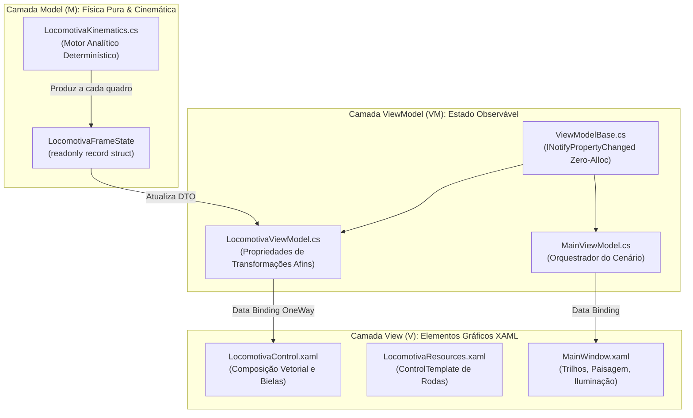

import MsLearnCard from '../../../components/MsLearnCard.astro';
import CodeInspector from '../../../components/CodeInspector.astro';
import SvgIcon from '../../../components/SvgIcon.astro';

A arquitetura de software da aplicação adota o padrão **MVVM (Model-View-ViewModel)** com um compromisso rígido de desacoplamento entre o motor analítico de física e o subsistema visual de renderização XAML.

O motor cinemático opera como uma classe pura em C#, completamente independente de classes de interface do usuário do WPF (`UIElement`, `DependencyObject`), viabilizando testes unitários sem interface gráfica e execução em modo headless.

---

## 1. Topologia de Camadas de Software

---

## 2. O Princípio Invariante da Origem $(0,0)$

Em estrita conformidade com as diretrizes do Trabalho C1 e as demonstrações teóricas dos slides de computação gráfica:

> *"Os elementos que compõem o corpo e as rodas devem ser desenhados na origem $(0,0)$ e posicionados utilizando RenderTransform."*

### Vantagens Técnicas do Invariante

1. **Desacoplamento Espacial**: A definição geométrica dos vértices não depende do local onde o objeto é exibido na tela.
2. **Reaproveitamento Estrutural em Modelos**: Um mesmo `ControlTemplate` de roda pode ser instanciado múltiplas vezes (eixos dianteiro e traseiro), mudando unicamente o vetor de translação local.
3. **Pivô de Rotação Determinístico**: A rotação em torno do centro do elemento é expressa de forma simples e invariável, com `CenterX = Largura / 2` e `CenterY = Altura / 2`.

---

## 3. `RenderTransform` versus `LayoutTransform`

O WPF dispõe de duas propriedades para manipulação matricial de elementos visuais:

  <table class="w-full text-xs font-mono border-collapse border border-[#1e293b]">
    <thead>
      <tr class="bg-[#0f172a] text-slate-200 border-b border-[#1e293b]">
        <th class="p-3 text-left">Aspecto Técnico</th>
        <th class="p-3 text-left">RenderTransform (Utilizado no Projeto)</th>
        <th class="p-3 text-left">LayoutTransform (Não Utilizado)</th>
      </tr>
    </thead>
    <tbody class="divide-y divide-[#1e293b] text-slate-300">
      <tr class="hover:bg-[#0f172a]/50">
        <td class="p-3 font-semibold text-cyan-400">Estágio no Pipeline Gráfico</td>
        <td class="p-3">Processado na etapa final de renderização diretamente na GPU.</td>
        <td class="p-3">Processado antes ou durante as passagens de Layout (Measure e Arrange).</td>
      </tr>
      <tr class="hover:bg-[#0f172a]/50">
        <td class="p-3 font-semibold text-cyan-400">Custo Computacional</td>
        <td class="p-3 text-emerald-400 font-semibold">Quase nulo (acelerado por hardware via DirectX).</td>
        <td class="p-3 text-rose-400">Elevado (força recálculo da árvore de layout na CPU).</td>
      </tr>
      <tr class="hover:bg-[#0f172a]/50">
        <td class="p-3 font-semibold text-cyan-400">Caixa Delimitadora (Bounding Box)</td>
        <td class="p-3">Não altera as dimensões alocadas pelo contêiner pai.</td>
        <td class="p-3">Modifica a geometria e a posição dos elementos vizinhos.</td>
      </tr>
      <tr class="hover:bg-[#0f172a]/50">
        <td class="p-3 font-semibold text-cyan-400">Adequação a Animações em Tempo Real</td>
        <td class="p-3 text-emerald-400 font-semibold">Ideal para taxas de 60 a 144 FPS sem stuttering.</td>
        <td class="p-3 text-rose-400">Inadequado para animações frequentes quadro a quadro.</td>
      </tr>
    </tbody>
  </table>

---

## 4. Otimização Zero-Alloc no Evento de Renderização

O loop de atualização gráfica da aplicação é acoplado ao pulso de sincronização vertical do monitor através do evento estático `CompositionTarget.Rendering`.

Para eliminar qualquer pressão sobre o **Garbage Collector (GC)** do .NET durante a execução contínua:

1. **Estado em Estrutura Imutável**: O estado por quadro é modelado como `readonly record struct LocomotivaFrameState`, alocado exclusivamente na stack do processador (zero alocações no heap gerenciado).
2. **Método SetProperty Otimizado**: No `ViewModelBase`, a verificação de igualdade numérica `EqualityComparer<T>.Default.Equals` evita o disparo desnecessário de eventos `PropertyChanged` quando os valores não sofrem alteração significativa.
3. **Ponteiros e Cálculos Escalares**: Todas as coordenadas $(X, Y)$ e ângulos são trafegados como valores primitivos `double`.

<CodeInspector
  title="Comparativo: Modelo Matemático C# vs Vinculação Declarativa XAML"
  xamlSnippet={`<!-- LocomotivaControl.xaml: Biela Primária com Transformações Afins -->
<Rectangle Width="82" Height="8" RadiusX="3" RadiusY="3"
           Fill="{StaticResource BielaPrimariaBrush}"
           Stroke="#1a1a1a" StrokeThickness="1"
           Canvas.Left="0" Canvas.Top="0">
    <Rectangle.RenderTransform>
        <TransformGroup>
            <!-- Rotação articulada no pino da manivela -->
            <RotateTransform Angle="{Binding BielaMotrizAngulo}"
                             CenterX="0" CenterY="4" />
            <!-- Translação espacial para a órbita do pino 2 -->
            <TranslateTransform X="{Binding BielaMotrizX}"
                                Y="{Binding BielaMotrizY}" />
        </TransformGroup>
    </Rectangle.RenderTransform>
</Rectangle>`}
  csharpSnippet={`// LocomotivaKinematics.cs: Cálculo Analítico da Biela Motriz
double catetoVertical = CentroRodasY - pino2Y;
double termoRadical = Math.Max(0.0, (ComprimentoBielaMotriz * ComprimentoBielaMotriz) - (catetoVertical * catetoVertical));
double catetoHorizontal = Math.Sqrt(termoRadical);
double xCruzeta = pino2X + catetoHorizontal;

// Ângulo exato em graus da biela motriz em relação à horizontal
double anguloBielaMotriz = Math.Atan2(CentroRodasY - pino2Y, xCruzeta - pino2X) * (180.0 / Math.PI);`}
  explanation="Observe como o XAML mantém a biela desenhada na origem local (0,0) e aplica o ângulo e as coordenadas X e Y calculados analiticamente pelo motor C# a cada pulso do CompositionTarget.Rendering."
/>

---

## 5. Referências Oficiais da Microsoft

<MsLearnCard
  title="Padrão Model-View-ViewModel (MVVM)"
  namespace="System.ComponentModel.INotifyPropertyChanged"
  category="Architecture"
  url="https://learn.microsoft.com/pt-br/dotnet/architecture/maui/mvvm"
  description="Conceitos fundamentais da arquitetura MVVM, separação da camada de apresentação e vinculação bidirecional de dados."
/>

<MsLearnCard
  title="Evento CompositionTarget.Rendering"
  namespace="System.Windows.Media.CompositionTarget"
  category="Animation"
  url="https://learn.microsoft.com/pt-br/dotnet/api/system.windows.media.compositiontarget.rendering"
  description="Gancho de renderização de baixo nível acoplado ao pulso de atualização da GPU para computação gráfica contínua a cada quadro."
/>
