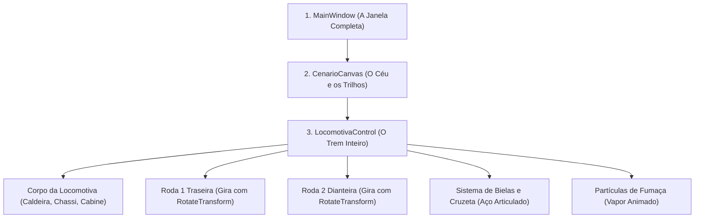

# 🏛️ Arquitetura e Princípios Gráficos: Como o Trem Foi Construído por Dentro

Se você nunca programou uma interface gráfica ou nunca estudou computação gráfica, este capítulo foi feito para você! Aqui explicamos a arquitetura do projeto usando analogias simples, mostrando como organizamos o código para que o trem seja bonito, rápido e fácil de entender.

---

## 1. O Sistema de Coordenadas: A Tela Como um Tabuleiro

Como vimos, a tela do computador funciona como uma folha quadriculada:
- O ponto de partida $(0,0)$ é no **canto superior esquerdo**.
- Para andar para a **direita**, somamos no eixo **$X$**.
- Para andar para **baixo**, somamos no eixo **$Y$**.

```
(0,0) Canto Superior Esquerdo
  +-------------------------> Eixo X (Direita)
  |
  |    (X=100, Y=50)
  |       * [Um Ponto Aqui]
  v
Eixo Y (Baixo)
```

No WPF, todas as medidas são feitas em **DIPs** (*Device-Independent Pixels*). Isso significa que, não importa se você está usando um monitor 4K gigante ou um notebook pequeno, o trem sempre terá a mesma proporção perfeita, sem ficar esticado nem minúsculo!

---

## 2. A "Regra de Ouro do Lego": Por Que Desenhar na Origem $(0,0)$?

Nas regras oficiais do trabalho (**[Trabalho C1 (Normas)](https://github.com/Gabriel-Freitas-S/PI_T1/blob/main/Trabalho/Trabalho%20C1.md#L32)**) e nas aulas do professor (**[Slide 2D:182-299](https://github.com/Gabriel-Freitas-S/PI_T1/blob/main/Slide/2D.md#L182-L299)**), existe uma exigência muito clara:
> *"Os elementos que compõem o corpo e as rodas devem ser desenhados na origem (0,0) e posicionados utilizando RenderTransform."*

### Por que isso é tão genial? (A Analogia do Bloco de Lego)
Imagine que você está brincando de Lego:
- Se você fabricar uma rodinha de plástico que já vem colada numa haste fixa a 2 metros de distância, você nunca vai conseguir colocar essa roda em outro lugar do carrinho.
- Mas se você fabricar a rodinha solta na sua caixinha limpa $(0,0)$, você pode usar um ímã (uma translação) para colocá-la na frente, atrás ou onde você quiser!

No nosso código:
1. **Desenhamos a peça na caixinha neutra $(0,0)$**.
2. **Movemos a peça com o [`TranslateTransform`](https://learn.microsoft.com/pt-br/dotnet/api/system.windows.media.translatetransform/)**.

Isso deixa o desenho desacoplado da posição: se amanhã você quiser empurrar a chaminé $10\text{ pixels}$ para o lado, você só altera o `TranslateTransform X="393"` sem precisar redesenhar os 4 vértices do cone!

---

## 3. `RenderTransform` vs `LayoutTransform`: Acelerando com a Placa de Vídeo

O WPF tem dois jeitos de mover coisas na tela:

### A Analogia da Reforma da Casa vs o Projetor de Luz:
- **`LayoutTransform` (A Reforma com Pedreiro)**: É como derrubar uma parede de tijolos dentro de casa para aumentar a sala. O pedreiro precisa parar tudo, recalcular o peso do teto e empurrar os móveis dos vizinhos. No computador, isso usa a **CPU** e faz a tela travar e dar engasgos.
- **`RenderTransform` (O Projetor de Luz / Camada do Photoshop)**: A casa continua intacta, mas você aponta uma lanterna ou projeta uma sombra que se move na parede. Quem processa isso é a sua **placa de vídeo (GPU)**, na velocidade da luz!

Por isso, **usamos `RenderTransform` em 100% da locomotiva**! Isso garante que o trem ande a 60 quadros por segundo super liso, sem esquentar o computador nem dar travamentos.  
Referência oficial: [Microsoft Learn — RenderTransform vs LayoutTransform](https://learn.microsoft.com/pt-br/dotnet/desktop/wpf/graphics-multimedia/transforms-overview/#differences-between-the-rendertransform-and-layouttransform-properties).

---

## 4. A Hierarquia dos `Canvas`: A Analogia das Bonecas Russas (*Matryoshka*)

Para não virar uma bagunça de peças soltas voando pela tela, organizamos o desenho em caixas dentro de caixas, como aquelas bonecas russas:



### Por que isso é incrível?
Quando o trem precisa andar para a frente na ferrovia:
- Nós **não precisamos** mover a caldeira, depois a cabine, depois o sino, depois as rodas um por um.
- Nós apenas dizemos: **"Locomotiva inteira, ande $5\text{ pixels}$ para a direita!"**
- Como todas as peças estão dentro da caixa da locomotiva, **tudo anda junto automaticamente** em perfeito bloco!

---

## 5. Quem Faz o Quê no Código? (A Analogia de Uma Companhia de Teatro)

Para manter o projeto organizado e profissional (seguindo o princípio de responsabilidade única - SRP), separamos o código em 4 pastas bem definidas:

| Arquivo | Papel na "Companhia de Teatro" | O que ele faz? |
| :--- | :--- | :--- |
| **`MainWindow.xaml`** | **O Palco e o Cenário** | Monta a janela, o céu da noite com estrelas, a linha do trem e o chão. |
| **`MainWindow.xaml.cs`** | **O Maestro da Orquestra** | Fica com o cronômetro na mão e avisa: *"Passou 1/60 de segundo, calculem a próxima cena!"* |
| **`LocomotivaControl.xaml`** | **Os Atores e o Figurino** | O desenho vetorial completo da locomotiva (chassi, caldeira, cabine, lanternas e bielas). |
| **`LocomotivaControl.xaml.cs`** | **O Coreógrafo Visual** | Recebe as posições e aplica nas peças certas dentro da locomotiva. |
| **`LocomotivaKinematics.cs`** | **O Físico / Matemático** | Um arquivo em C# puro (sem gráficos) que calcula as contas de Pitágoras, ângulos das rodas e a posição do pistão. |
| **`LocomotivaResources.xaml`** | **O Guarda-Roupa / Formas de Bolo** | Onde guardamos os moldes reutilizáveis das rodas (`RodaTemplate`) e dos anéis das bielas (`MancalBielaTemplate`). |

Essa separação limpa garante que, se um dia você quiser colocar essa locomotiva em outro jogo ou aplicativo, você só precisa copiar a pastinha `Controls/` e `Models/`!

---

## 6. 📖 O Ponto de Partida: `App.xaml` e `App.xaml.cs` Explicados Linha a Linha

Toda aplicação WPF começa a viver por esses dois arquivos:

### 6.1 `App.xaml` (A Gaveta Global de Recursos)
Este arquivo configura a inicialização da janela e carrega nossos materiais:

```xml
<Application x:Class="PI_T1.App"
             xmlns="http://schemas.microsoft.com/winfx/2006/xaml/presentation"
             xmlns:x="http://schemas.microsoft.com/winfx/2006/xaml"
             xmlns:local="clr-namespace:PI_T1"
             StartupUri="MainWindow.xaml">
    <Application.Resources>
        <ResourceDictionary>
            <ResourceDictionary.MergedDictionaries>
                <!-- Carrega globalmente o molde da roda, do mancal e as cores de aço -->
                <ResourceDictionary Source="Resources/LocomotivaResources.xaml"/>
            </ResourceDictionary.MergedDictionaries>
        </ResourceDictionary>
    </Application.Resources>
</Application>
```
- `StartupUri="MainWindow.xaml"`: Informa ao Windows: *"Assim que o programa abrir, crie e mostre a janela principal `MainWindow`"*.
- `<ResourceDictionary.MergedDictionaries>`: Funciona como uma gaveta aberta para todo mundo. Ao colocar o [`LocomotivaResources.xaml`](https://github.com/Gabriel-Freitas-S/PI_T1/blob/main/Resources/LocomotivaResources.xaml) aqui, qualquer tela do aplicativo consegue acessar as cores de aço (`AcoPolidoBrush`) e a forma de corte da roda (`RodaTemplate`) automaticamente!

---

### 6.2 `App.xaml.cs` (Inicialização e Modo de Gravação de Fotos/GIF)

Além de abrir a janela normal, o [`App.xaml.cs`](https://github.com/Gabriel-Freitas-S/PI_T1/blob/main/App.xaml.cs) possui um recurso avançado para gerar fotos automáticas via terminal:

```csharp
protected override void OnStartup(StartupEventArgs e)
{
    base.OnStartup(e);

    // MODO 1: Se o usuário rodar "dotnet run -- --screenshot 3.5"
    if (e.Args.Length > 0 && e.Args[0] == "--screenshot")
    {
        var window = new MainWindow();
        window.Show();
        window.Measure(new Size(1100, 620));
        window.Arrange(new Rect(0, 0, 1100, 620));
        window.UpdateLayout();

        // 1. Calcula a física no segundo exato (ex: 3.5s)
        double t = 3.5;
        var kin = new Models.LocomotivaKinematics();
        var st = kin.CalcularQuadro(t);
        window.Locomotiva.AtualizarEstado(st);
        window.Locomotiva.AtualizarFumaca(t);
        window.UpdateLayout();

        // 2. Tira uma foto digital direto da memória com RenderTargetBitmap
        var rtb = new RenderTargetBitmap(1100, 620, 96, 96, PixelFormats.Pbgra32);
        rtb.Render(window);

        // 3. Salva a foto em PNG no disco
        using var fs = File.Open("frame_check.png", FileMode.Create);
        var encoder = new PngBitmapEncoder();
        encoder.Frames.Add(BitmapFrame.Create(rtb));
        encoder.Save(fs);

        Shutdown(); // Fecha o programa automaticamente
        return;
    }
}
```

#### O que é o `RenderTargetBitmap`?
É como uma **câmera fotográfica invisível** do WPF! Ela tira uma foto com qualidade máxima de $1100 \times 620\text{ pixels}$ diretamente da memória da placa de vídeo e salva como arquivo de imagem `.png`, sem precisar que uma pessoa aperte `PrintScreen` no teclado!

---

## 🔗 Referências Oficiais da Microsoft
- [Microsoft Learn — Painel Canvas no WPF](https://learn.microsoft.com/pt-br/dotnet/desktop/wpf/controls/canvas/)
- [Microsoft Learn — Visão Geral de Transformações no WPF](https://learn.microsoft.com/pt-br/dotnet/desktop/wpf/graphics-multimedia/transforms-overview/)
- [Microsoft Learn — Classe TranslateTransform](https://learn.microsoft.com/pt-br/dotnet/api/system.windows.media.translatetransform/)
- [Microsoft Learn — Classe RotateTransform](https://learn.microsoft.com/pt-br/dotnet/api/system.windows.media.rotatetransform/)
- [Microsoft Learn — Classe TransformGroup](https://learn.microsoft.com/pt-br/dotnet/api/system.windows.media.transformgroup/)
- [Microsoft Learn — Classe Application e Ciclo de Vida](https://learn.microsoft.com/pt-br/dotnet/api/system.windows.application)
- [Microsoft Learn — Classe RenderTargetBitmap](https://learn.microsoft.com/pt-br/dotnet/api/system.windows.media.imaging.rendertargetbitmap)
