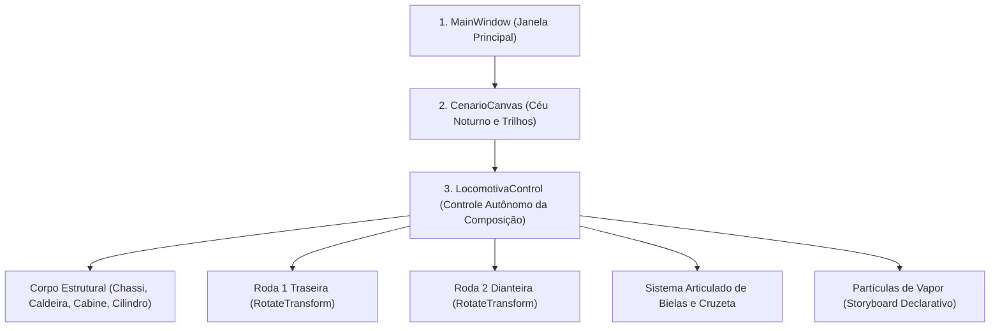

# 🏛️ Arquitetura e Princípios de Transformações 2D

Neste capítulo, aborda-se a base arquitetural e os fundamentos gráficos do projeto, explorando como o subsistema vetorial do **Windows Presentation Foundation (WPF)** processa primitivas geométricas, gerencia transformações afins por hardware e organiza a separação de responsabilidades (SRP).

---

## 1. O Sistema de Coordenadas do WPF

O WPF opera nativamente com **Device-Independent Pixels (DIPs)**, onde cada unidade lógica equivale a $\frac{1}{96}$ de polegada, garantindo independência total de escala entre diferentes densidades de monitores (DPI):

- **Origem Canônica $(0,0)$**: O vértice superior esquerdo da área cliente representa a coordenada de referência.
- **Eixo X**: Cresce positivamente para a **direita** $(\to)$.
- **Eixo Y**: Cresce positivamente para **baixo** $(\downarrow)$ (convenção padrão de sistemas de computação gráfica).
- **Orientação Angular**: No WPF, rotações positivas operam no **sentido horário**, alinhando-se ao sentido de rolamento natural da locomotiva em direção à direita.

```
(0,0) Origem
  +-------------------------> Eixo X (Direita)
  |
  |    (X=100, Y=50)
  |       * [Ponto no Espaço Vetorial]
  v
Eixo Y (Baixo)
```

---

## 2. O Princípio Invariante da Origem $(0,0)$

Em estrita observância aos requisitos normativos do **[Trabalho C1 (Normas)](https://github.com/Gabriel-Freitas-S/PI_T1/blob/main/Trabalho/Trabalho%20C1.md#L32)** e às demonstrações dos slides teóricos (**[Slide 2D:182-299](https://github.com/Gabriel-Freitas-S/PI_T1/blob/main/Slide/2D.md#L182-L299)**):
> *"Os elementos que compõem o corpo e as rodas devem ser desenhados na origem (0,0) e posicionados utilizando RenderTransform."*

### Vantagens Arquiteturais do Invariante $(0,0)$:
1. **Desacoplamento Espacial**: A definição geométrica da forma é dissociada de sua posição física na cena.
2. **Reúso Estrutural em Modelos**: Um mesmo bloco ou template pode ser reutilizado em múltiplas instâncias no espaço, aplicando-se apenas diferentes vetores de translação.
3. **Pivô de Rotação Estável**: A rotação em torno do centro do objeto torna-se determinística, pois os parâmetros `CenterX` e `CenterY` referenciam diretamente as coordenadas locais do contêiner da peça.

No projeto:
- Toda forma primitiva nasce ancorada em sua origem canônica $(0,0)$.
- O posicionamento no espaço global é realizado exclusivamente via [`TranslateTransform`](https://learn.microsoft.com/pt-br/dotnet/api/system.windows.media.translatetransform/).

---

## 3. `RenderTransform` versus `LayoutTransform`: Aceleração Gráfica na GPU

O WPF oferece duas propriedades distintas para a aplicação de matrizes de transformação afim em elementos da interface:

| Característica | `RenderTransform` | `LayoutTransform` |
| :--- | :--- | :--- |
| **Pipeline Gráfico** | Processada após as etapas de medição e arranjo (`Measure`/`Arrange`). | Executada antes ou durante as passagens de Layout. |
| **Consumo de Processamento** | Extremamente baixo (processada diretamente pela GPU via DirectX). | Elevado (força recalculação de limites e reposiciona vizinhos na CPU). |
| **Efeito em Contêineres** | Não altera o retângulo envolvente alocado pelo contêiner pai. | Modifica a caixa delimitadora (`BoundingBox`) dos elementos adjacentes. |
| **Adoção no Projeto** | **Utilizada em 100% dos elementos dinâmicos da locomotiva.** | Não utilizada, evitando gargalos de desempenho a 60 FPS. |

> [!TIP]
> A utilização irrestrita de `RenderTransform` garante que as 9 transformações afins calculadas quadro a quadro em `CompositionTarget.Rendering` sejam executadas diretamente pela GPU, assegurando taxa contínua de 60 quadros por segundo sem reflow visual.  
> Referência oficial: [Microsoft Learn — RenderTransform vs LayoutTransform](https://learn.microsoft.com/pt-br/dotnet/desktop/wpf/graphics-multimedia/transforms-overview/#differences-between-the-rendertransform-and-layouttransform-properties).

---

## 4. Hierarquia Visual dos `Canvas`: Encapsulamento em Camadas

A composição da cena ferroviária organiza-se em uma árvore hierárquica estrita de contêineres [`Canvas`](https://learn.microsoft.com/pt-br/dotnet/desktop/wpf/controls/canvas/):



### Propriedades do Encapsulamento:
Ao estruturar todas as peças estruturais sob o nó pai `LocomotivaCanvas`, o deslocamento horizontal global da composição ferroviária requer unicamente a modificação da propriedade `TranslacaoLocomotiva.X`. Todos os nós filhos (caldeira, cabine, rodas, mancais e bielas) acompanham rigidamente o deslocamento em bloco.

---

## 5. Separação de Responsabilidades e Arquitetura em Camadas (SRP)

O projeto adota o **Princípio da Responsabilidade Única (Single Responsibility Principle - SRP)**, decompondo as atribuições em camadas desacopladas:

| Componente | Papel Arquitetural | Atribuição Técnica |
| :--- | :--- | :--- |
| **`MainWindow.xaml`** | **Camada de Apresentação (View Shell)** | Estruturação da casca visual da janela, painéis informativos e cenário contínuo dos trilhos. |
| **`MainWindow.xaml.cs`** | **Orquestrador de Ciclo de Vida** | Gerenciamento do cronômetro de alta precisão e ponte entre `CompositionTarget.Rendering` e a visão. |
| **`LocomotivaControl.xaml`** | **Composição Vetorial do Trem** | Declaração geométrica completa da locomotiva, instâncias de rodas, bielas e disparadores de fumaça. |
| **`LocomotivaControl.xaml.cs`** | **Controlador de Transformações Visuais** | Interface que recebe o estado do motor analítico e atualiza as 9 matrizes de transformação afim internas. |
| **`LocomotivaKinematics.cs`** | **Motor Físico e Cinemático** | Módulo em C# puro (sem dependências de UI) responsável pelo cálculo trigonométrico analítico da máquina. |
| **`LocomotivaResources.xaml`** | **Dicionário Compartilhado de Recursos** | Repositório centralizado de modelos de controle (`RodaTemplate`, `MancalBielaTemplate`) e paleta semântica de materiais. |

---

## 6. 📖 O Ponto de Entrada da Aplicação: `App.xaml` e `App.xaml.cs`

A inicialização e os modos operacionais da aplicação são configurados nos seguintes módulos:

### 6.1 `App.xaml` (Dicionários Mesclados Globais)
Define a janela de inicialização e compartilha globalmente os recursos estruturais:

```xml
<Application x:Class="PI_T1.App"
             xmlns="http://schemas.microsoft.com/winfx/2006/xaml/presentation"
             xmlns:x="http://schemas.microsoft.com/winfx/2006/xaml"
             xmlns:local="clr-namespace:PI_T1"
             StartupUri="MainWindow.xaml">
    <Application.Resources>
        <ResourceDictionary>
            <ResourceDictionary.MergedDictionaries>
                <!-- Compartilhamento global do RodaTemplate, MancalBielaTemplate e pincéis -->
                <ResourceDictionary Source="Resources/LocomotivaResources.xaml"/>
            </ResourceDictionary.MergedDictionaries>
        </ResourceDictionary>
    </Application.Resources>
</Application>
```
- `StartupUri="MainWindow.xaml"`: Declara a janela de inicialização padrão da aplicação.
- `<ResourceDictionary.MergedDictionaries>`: Garante que os recursos declarados em `LocomotivaResources.xaml` estejam acessíveis a qualquer nó da árvore visual sem a necessidade de importações locais redundantes.

---

### 6.2 `App.xaml.cs` (Execução Interativa e Automação Headless)

O arquivo [`App.xaml.cs`](https://github.com/Gabriel-Freitas-S/PI_T1/blob/main/App.xaml.cs) sobrescreve o método `OnStartup`, provendo suporte a parâmetros de linha de comando para renderização e testes automatizados:

```csharp
protected override void OnStartup(StartupEventArgs e)
{
    base.OnStartup(e);

    // MODO SCREENSHOT: Execução automatizada para auditoria visual de quadro
    if (e.Args.Length > 0 && e.Args[0] == "--screenshot")
    {
        var window = new MainWindow();
        window.Show();
        window.Measure(new Size(1100, 620));
        window.Arrange(new Rect(0, 0, 1100, 620));
        window.UpdateLayout();

        // 1. Amostragem analítica no instante solicitado (ex: t = 3.5s)
        double t = 3.5;
        var kin = new Models.LocomotivaKinematics();
        var st = kin.CalcularQuadro(t);
        window.Locomotiva.AtualizarEstado(st);
        window.Locomotiva.AtualizarFumaca(t);
        window.UpdateLayout();

        // 2. Renderização em buffer de imagem em memória (RenderTargetBitmap)
        var rtb = new RenderTargetBitmap(1100, 620, 96, 96, PixelFormats.Pbgra32);
        rtb.Render(window);

        // 3. Serialização da imagem no formato PNG
        using var fs = File.Open("frame_check.png", FileMode.Create);
        var encoder = new PngBitmapEncoder();
        encoder.Frames.Add(BitmapFrame.Create(rtb));
        encoder.Save(fs);

        Shutdown();
        return;
    }
}
```

#### Renderização com `RenderTargetBitmap`:
A classe [`RenderTargetBitmap`](https://learn.microsoft.com/pt-br/dotnet/api/system.windows.media.imaging.rendertargetbitmap) possibilita a rasterização de árvores visuais do WPF diretamente em buffers de memória (*off-screen rendering*), viabilizando a captura determinística de quadros sem dependência de intervenção do usuário ou ferramentas externas de captura de tela.

---

## 🔗 Referências Oficiais da Microsoft
- [Microsoft Learn — Painel Canvas no WPF](https://learn.microsoft.com/pt-br/dotnet/desktop/wpf/controls/canvas/)
- [Microsoft Learn — Visão Geral de Transformações no WPF](https://learn.microsoft.com/pt-br/dotnet/desktop/wpf/graphics-multimedia/transforms-overview/)
- [Microsoft Learn — Classe TranslateTransform](https://learn.microsoft.com/pt-br/dotnet/api/system.windows.media.translatetransform/)
- [Microsoft Learn — Classe RotateTransform](https://learn.microsoft.com/pt-br/dotnet/api/system.windows.media.rotatetransform/)
- [Microsoft Learn — Classe TransformGroup](https://learn.microsoft.com/pt-br/dotnet/api/system.windows.media.transformgroup/)
- [Microsoft Learn — Classe Application e Ciclo de Vida](https://learn.microsoft.com/pt-br/dotnet/api/system.windows.application)
- [Microsoft Learn — Classe RenderTargetBitmap](https://learn.microsoft.com/pt-br/dotnet/api/system.windows.media.imaging.rendertargetbitmap)
