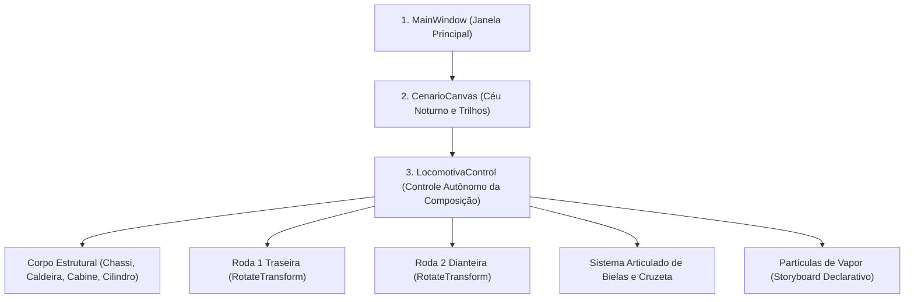
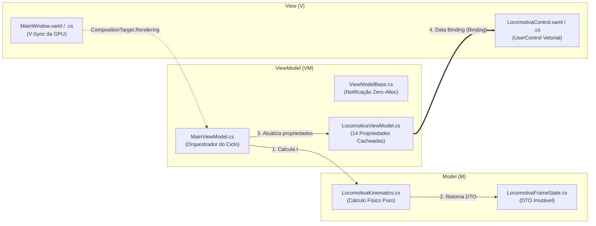

# Arquitetura do Sistema e Princípios de Transformações 2D

[](file:///d:/ProcessamentoDeImagens/PI_T1/wiki/Arquitetura-e-Visao-Geral.md)
[](https://learn.microsoft.com/pt-br/dotnet/desktop/wpf/graphics-multimedia/transforms-overview/)
[](https://dotnet.microsoft.com/)

Neste capítulo, aborda-se a base arquitetural e os fundamentos gráficos do projeto, explorando como o subsistema vetorial do **Windows Presentation Foundation (WPF)** processa primitivas geométricas, gerencia transformações afins aceleradas por hardware (GPU) e organiza a separação de responsabilidades no padrão **MVVM (Model-View-ViewModel)** com otimização de zero alocações na heap.

---

## 1. Organização Estrutural do Projeto

A solução foi estruturada para garantir desacoplamento total entre lógica de domínio/física, estado de apresentação reativo e árvores visuais de renderização:

```text
PI_T1/
├── Models/                     # Camada Model (M): Física e Cinemática Pura
│   ├── LocomotivaKinematics.cs # Motor analítico: trajetória, velocidades e mecanismos
│   └── LocomotivaFrameState.cs # DTO imutável (readonly record struct) por quadro
├── ViewModels/                 # Camada ViewModel (VM): Estado de Apresentação e Notificações
│   ├── ViewModelBase.cs        # Infraestrutura INotifyPropertyChanged com Zero-Alloc
│   ├── LocomotivaViewModel.cs  # Propriedades observáveis das transformações afins
│   └── MainViewModel.cs        # Orquestrador global, títulos e status dinâmico
├── Controls/                   # Camada View (V): Controles Visuais Vetoriais
│   ├── LocomotivaControl.xaml  # Modelagem vetorial XAML declarativa com Data Binding
│   └── LocomotivaControl.xaml.cs # Code-behind desacoplado e reativo
├── Resources/                  # Recursos e Modelos Reutilizáveis
│   └── LocomotivaResources.xaml# ControlTemplates (rodas, mancais) e pincéis de materiais
├── MainWindow.xaml             # Casca visual da aplicação e cenário ferroviário
├── MainWindow.xaml.cs          # Associação de DataContext e gancho em CompositionTarget.Rendering
├── App.xaml / App.xaml.cs      # Ciclo de vida e suporte headless (--screenshot, --record-frames)
├── PI_T1.csproj                # Definição do projeto SDK (.NET 10, UseWPF=true)
└── generate_gif.ps1            # Script de automação e renderização de vídeo/GIF
```

---

## 2. O Sistema de Coordenadas do WPF

O WPF opera nativamente com **Device-Independent Pixels (DIPs)**, onde cada unidade lógica equivale a $\frac{1}{96}$ de polegada, garantindo independência total de escala entre diferentes densidades de monitores (DPI):

- **Origem Canônica $(0,0)$**: O vértice superior esquerdo da área cliente representa a coordenada de referência.
- **Eixo X**: Cresce positivamente para a **direita** $(\to)$.
- **Eixo Y**: Cresce positivamente para **baixo** $(\downarrow)$ (convenção padrão de sistemas de computação gráfica).
- **Orientação Angular**: No WPF, rotações positivas operam no **sentido horário**, alinhando-se ao sentido de rolamento natural da locomotiva em direção à direita.

```text
(0,0) Origem Canônica
  +-------------------------> Eixo X (Direita)
  |
  |    (X=100, Y=50)
  |       * [Ponto no Espaço Vetorial]
  |
  v
Eixo Y (Baixo)
```

---

## 3. O Princípio Invariante da Origem $(0,0)$

Em estrita observância aos requisitos normativos do **[Trabalho C1 (Normas)](https://github.com/Gabriel-Freitas-S/PI_T1/blob/main/Trabalho/Trabalho%20C1.md#L32)** e às demonstrações dos slides teóricos (**[Slide 2D:182-299](https://github.com/Gabriel-Freitas-S/PI_T1/blob/main/Slide/2D.md#L182-L299)**):
> *"Os elementos que compõem o corpo e as rodas devem ser desenhados na origem (0,0) e posicionados utilizando RenderTransform."*

### Vantagens Técnicas do Invariante $(0,0)$:
1. **Desacoplamento Espacial**: A definição geométrica da forma é dissociada de sua posição física na cena.
2. **Reúso Estrutural em Modelos**: Um mesmo bloco ou template pode ser reutilizado em múltiplas instâncias no espaço, aplicando-se apenas diferentes vetores de translação.
3. **Pivô de Rotação Determinístico**: A rotação em torno do centro do objeto torna-se previsível, pois os parâmetros `CenterX` e `CenterY` referenciam diretamente as coordenadas locais do contêiner da peça.

No projeto:
- Toda forma primitiva nasce ancorada em sua origem canônica $(0,0)$.
- O posicionamento no espaço global é realizado exclusivamente via [`TranslateTransform`](https://learn.microsoft.com/pt-br/dotnet/api/system.windows.media.translatetransform/).

---

## 4. `RenderTransform` versus `LayoutTransform`: Aceleração Gráfica por Hardware

O WPF oferece duas propriedades distintas para a aplicação de matrizes de transformação afim em elementos da interface:

| Característica | `RenderTransform` | `LayoutTransform` |
| :--- | :--- | :--- |
| **Pipeline Gráfico** | Processada após as etapas de medição e arranjo (`Measure`/`Arrange`). | Executada antes ou durante as passagens de Layout. |
| **Consumo de Processamento** | Extremamente baixo (processada diretamente pela GPU via DirectX). | Elevado (força recalculação de limites e reposiciona vizinhos na CPU). |
| **Efeito em Contêineres** | Não altera o retângulo envolvente alocado pelo contêiner pai. | Modifica a caixa delimitadora (`BoundingBox`) dos elementos adjacentes. |
| **Adoção no Projeto** | **Utilizada em 100% dos elementos dinâmicos da locomotiva.** | Não utilizada, evitando gargalos de desempenho a 60/144 FPS. |

> [!TIP]
> A utilização irrestrita de `RenderTransform` garante que as 9 transformações afins calculadas quadro a quadro em `CompositionTarget.Rendering` sejam processadas diretamente pelos pipelines de shaders da GPU, assegurando fluidez absoluta sem *reflow* visual.  
> Referência oficial: [Microsoft Learn — RenderTransform vs LayoutTransform](https://learn.microsoft.com/pt-br/dotnet/desktop/wpf/graphics-multimedia/transforms-overview/#differences-between-the-rendertransform-and-layouttransform-properties).

---

## 5. Hierarquia Visual dos `Canvas`: Encapsulamento em Camadas

A composição da cena ferroviária organiza-se em uma árvore hierárquica estrita de contêineres [`Canvas`](https://learn.microsoft.com/pt-br/dotnet/desktop/wpf/controls/canvas/):



### Inversão de Orientação via `ScaleTransform`

No `LocomotivaControl.xaml`, o contêiner raiz da locomotiva aplica um `TransformGroup` composto por:
1. `ScaleTransform`: Responsável pela inversão horizontal (`ScaleX = 1.0` quando avança para a direita; `ScaleX = -1.0` quando avança para a esquerda). Com o centro calibrado em `CenterX="280"`, a largura total de $560\text{ px}$ é espelhada simetricamente em torno de seu eixo médio.
2. `TranslateTransform`: Posiciona a caixa delimitadora da locomotiva no eixo horizontal da cena (`X="{Binding LocomotivaX}"`).

```xml
<Canvas x:Name="LocomotivaCanvas" Width="560" Height="300">
    <Canvas.RenderTransform>
        <TransformGroup>
            <ScaleTransform x:Name="EscalaDirecaoLocomotiva" 
                            ScaleX="{Binding EscalaDirecaoX, FallbackValue=1.0}" 
                            CenterX="280" CenterY="150"/>
            <TranslateTransform x:Name="TranslacaoLocomotiva" 
                                X="{Binding LocomotivaX, FallbackValue=20}" 
                                Y="155"/>
        </TransformGroup>
    </Canvas.RenderTransform>
    ...
</Canvas>
```

---

## 6. Arquitetura MVVM (Model-View-ViewModel) de Alta Performance (Zero-Alloc)

O projeto implementa rigorosamente a separação de responsabilidades do padrão **MVVM**:



### Análise Detalhada dos Componentes

#### 6.1 `Models/LocomotivaKinematics.cs` (Model de Cinemática Analítica Pura)
- **Papel**: Classe em C# puro sem qualquer dependência de classes gráficas do WPF (`System.Windows`).
- **Responsabilidade**: Calcula a posição instantânea $X(t)$, a velocidade escalar $v(t)$, o ângulo acumulado de rolamento $\theta(t)$, os pinos de manivela $(pino1X, pino1Y)$ e $(pino2X, pino2Y)$, a posição da cruzeta via Teorema de Pitágoras, o ângulo da biela motriz via $\text{atan2}$, o fator de escala direcional `EscalaDirecaoX` e a mensagem contextual de status.

#### 6.2 `Models/LocomotivaFrameState.cs` (Objeto de Transferência de Estado)
- **Papel**: `readonly record struct` com passagem por valor ou por referência (`in`).
- **Responsabilidade**: Encapsula as 15 variáveis de coordenadas e ângulos do quadro instantâneo, garantindo imutabilidade e zero alocações na heap.

#### 6.3 `ViewModels/ViewModelBase.cs` (Infraestrutura Reativa Zero-Alloc)
- **Papel**: Implementação da interface [`INotifyPropertyChanged`](https://learn.microsoft.com/pt-br/dotnet/api/system.componentmodel.inotifypropertychanged).
- **Otimização Crítica**: Além do método tradicional com `[CallerMemberName]`, provê a sobrecarga:
  ```csharp
  protected bool SetProperty<T>(ref T field, T value, PropertyChangedEventArgs args)
  ```
  Ao receber instâncias pré-alocadas de `PropertyChangedEventArgs`, elimina a instanciação de centenas de objetos por segundo que sobrecarregariam o Garbage Collector (Gen 0) a cada quadro de animação.

#### 6.4 `ViewModels/LocomotivaViewModel.cs` (ViewModel Específica da Locomotiva)
- **Papel**: Expõe as 14 propriedades observáveis vinculadas ao XAML.
- **Implementação**: Mantém instâncias estáticas cacheadas:
  ```csharp
  private static readonly PropertyChangedEventArgs LocomotivaXArgs = new(nameof(LocomotivaX));
  private static readonly PropertyChangedEventArgs EscalaDirecaoXArgs = new(nameof(EscalaDirecaoX));
  ...
  ```
  O método `AtualizarEstado(in LocomotivaFrameState estado)` atualiza em bloco as variáveis locais disparando notificações sem alocação de memória.

#### 6.5 `ViewModels/MainViewModel.cs` (ViewModel Raiz da Aplicação)
- **Papel**: Centraliza o estado global da aplicação (título, subtítulo, autor e status dinâmico).
- **Orquestração**: Possui método `AtualizarQuadro(double tempoSegundos, double larguraCenario)`, que consulta o Model e repassa o estado para a filha `LocomotivaViewModel`.

#### 6.6 `MainWindow.xaml.cs` (Gancho no Pipeline Gráfico via `CompositionTarget.Rendering`)
- **Papel**: Atua estritamente como a casca de apresentação da View.
- **Operação**: Conecta-se ao evento de taxa de atualização do monitor da GPU:
  ```csharp
  Loaded += (_, _) =>
  {
      ViewModel.Reset();
      _cronometro.Restart();
      CompositionTarget.Rendering += AtualizarQuadroMecanico;
  };
  ```
  A cada quadro de tela (60 Hz, 120 Hz ou 144 Hz), lê o tempo do `Stopwatch` de alta precisão e delega o cálculo ao `MainViewModel`.

#### 6.7 `Controls/LocomotivaControl.xaml.cs` (UserControl Vetorial)
- **Papel**: View especializada da locomotiva.
- **Desacoplamento**: Não contém manipulação direta de matrizes de transformação, delegando a atualização do estado exclusivamente ao `LocomotivaViewModel` e confiando no mecanismo declarativo do Data Binding do WPF.

---

## 7. Ponto de Entrada da Aplicação: `App.xaml` e `App.xaml.cs`

### 7.1 `App.xaml` (Dicionários Mesclados Globais)
Centraliza os recursos globais para que os `ControlTemplate` e os pincéis estejam acessíveis em qualquer nível da árvore visual:

```xml
<Application x:Class="PI_T1.App"
             xmlns="http://schemas.microsoft.com/winfx/2006/xaml/presentation"
             xmlns:x="http://schemas.microsoft.com/winfx/2006/xaml"
             StartupUri="MainWindow.xaml">
    <Application.Resources>
        <ResourceDictionary>
            <ResourceDictionary.MergedDictionaries>
                <ResourceDictionary Source="Resources/LocomotivaResources.xaml"/>
            </ResourceDictionary.MergedDictionaries>
        </ResourceDictionary>
    </Application.Resources>
</Application>
```

### 7.2 `App.xaml.cs` (Automação Headless e Renderização Off-Screen)
O ponto de entrada sobrescreve `OnStartup`, permitindo a execução de testes automatizados e gravação de animações via linha de comando com a classe [`RenderTargetBitmap`](https://learn.microsoft.com/pt-br/dotnet/api/system.windows.media.imaging.rendertargetbitmap):
- `--screenshot <tempo> <arquivo>`: Renderiza um quadro estático determinístico no instante especificado e serializa em arquivo PNG.
- `--record-frames <duracao> <fps> <diretorio>`: Renderiza uma sequência completa de quadros brutos para montagem de GIFs com FFmpeg.

---

## 8. Referências Oficiais da Microsoft
- [Microsoft Learn — Visão Geral do Data Binding no WPF](https://learn.microsoft.com/pt-br/dotnet/desktop/wpf/data/data-binding-overview)
- [Microsoft Learn — Como Implementar a Notificação de Alteração de Propriedade](https://learn.microsoft.com/pt-br/dotnet/desktop/wpf/data/how-to-implement-property-change-notification)
- [Microsoft Learn — Otimizando o Desempenho da Associação de Dados](https://learn.microsoft.com/pt-br/dotnet/desktop/wpf/advanced/optimizing-performance-data-binding)
- [Microsoft Learn — Visão Geral de Transformações no WPF](https://learn.microsoft.com/pt-br/dotnet/desktop/wpf/graphics-multimedia/transforms-overview/)
- [Microsoft Learn — Evento CompositionTarget.Rendering](https://learn.microsoft.com/pt-br/dotnet/api/system.windows.media.compositiontarget.rendering)
- [Microsoft Learn — Classe RenderTargetBitmap](https://learn.microsoft.com/pt-br/dotnet/api/system.windows.media.imaging.rendertargetbitmap)

