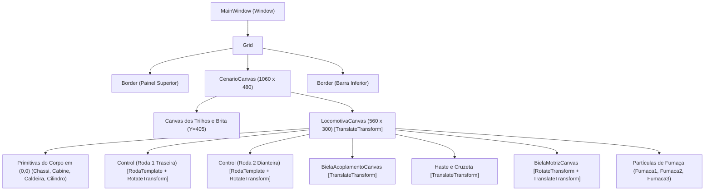

# 🏛️ Arquitetura e Princípios de Transformações 2D

Neste capítulo, aborda-se a base arquitetural do projeto, fundamentada na teoria de **Computação Gráfica e Processamento de Imagens**, explorando como o subsistema vetorial do **WPF (Windows Presentation Foundation)** processa primitivas geométricas, gerencia transformações afins e mantém o rigor matemático exigido nas aulas e enunciados.

---

## 1. O Sistema de Coordenadas do WPF

Diferente de sistemas gráficos clássicos de desenho por pixels brutos (como GDI ou buffers rasterizados), o WPF opera com **Device-Independent Pixels (DIPs)**, onde cada unidade lógica equivale a $\frac{1}{96}$ de polegada.

- **Origem $(0,0)$ da Tela**: O canto superior esquerdo da área cliente representa a coordenada $(0,0)$.
- **Eixo X**: Cresce positivamente para a **direita**.
- **Eixo Y**: Cresce positivamente para **baixo** (convenção padrão de telas digitais).
- **Ângulos de Rotação**: No WPF, valores positivos de ângulos em graus (`Angle > 0`) produzem rotações no **sentido horário**, enquanto ângulos negativos produzem rotações no sentido anti-horário.

> [!NOTE]
> Para consultar a documentação oficial sobre coordenadas e transformações no WPF, acesse:  
> [Microsoft Learn — Visão Geral de Transformações](https://learn.microsoft.com/pt-br/dotnet/desktop/wpf/graphics-multimedia/transforms-overview/)

---

## 2. O Princípio Invariante da Origem $(0,0)$

Um dos requisitos mandatórios estipulados no enunciado acadêmico **[Trabalho C1 (Normas)](https://github.com/Gabriel-Freitas-S/PI_T1/blob/main/Trabalho/Trabalho%20C1.md#L32)** e demonstrado nos slides da disciplina (**[Slide 2D:182-299](https://github.com/Gabriel-Freitas-S/PI_T1/blob/main/Slide/2D.md#L182-L299)**) é:

> *"Os elementos que compõem o corpo e as rodas devem ser desenhados na origem (0,0) e posicionados utilizando RenderTransform."*

### Por que desenhar em $(0,0)$ e não em posições absolutas?
Se uma primitiva geométrica for modelada com coordenadas embutidas diretamente nos seus vértices (por exemplo, um retângulo com `X="200"` e `Y="150"`):
1. **Perda de Reutilização**: O elemento não pode ser instanciado em múltiplos pontos da tela via templates.
2. **Complexidade de Rotação**: Para rotacionar um elemento em torno de seu próprio centro de gravidade, torna-se necessário rastrear continuamente onde ele está no espaço global e alterar manualmente o ponto pivô (`CenterX`, `CenterY`).
3. **Composição Matricial Suja**: A matriz de transformação acaba acumulando translações absolutas misturadas à rotação.

Ao definir todo elemento gráfico ancorado na sua origem canônica $(0,0)$ e aplicar suas posições espaciais através de `RenderTransform` (`TranslateTransform`, `RotateTransform`, `ScaleTransform`), a arquitetura atinge:
- **Ortogonalidade**: A forma gráfica é desacoplada da sua posição no mundo.
- **Parametrização**: Uma única definição (`ControlTemplate`) pode ser instanciada em $N$ posições apenas mudando sua translação.
- **Comutação Elegante**: A rotação em torno do centro do objeto é feita simplesmente fixando `CenterX` e `CenterY` no espaço local da forma.

---

## 3. Composição e Álgebra Linear de Transformações Afins

No plano 2D, as transformações afins preservam linhas retas e paralelismos. Em coordenadas homogêneas, um ponto `P = (x, y)` é representado pelo vetor `[x, y, 1]ᵀ`.

A matriz geral de transformação afim 3×3 no WPF é dada por:

```math
\begin{bmatrix} x' \\ y' \\ 1 \end{bmatrix} = \begin{bmatrix} M_{11} & M_{12} & 0 \\ M_{21} & M_{22} & 0 \\ \text{OffsetX} & \text{OffsetY} & 1 \end{bmatrix}^T \begin{bmatrix} x \\ y \\ 1 \end{bmatrix}
```

Onde:

- **Translação pura (`TranslateTransform`)**:

```math
\begin{bmatrix} 1 & 0 & 0 \\ 0 & 1 & 0 \\ \Delta X & \Delta Y & 1 \end{bmatrix}
```

- **Rotação pura (`RotateTransform`)** por um ângulo θ:

```math
\begin{bmatrix} \cos\theta & \sin\theta & 0 \\ -\sin\theta & \cos\theta & 0 \\ 0 & 0 & 1 \end{bmatrix}
```

No projeto da locomotiva, quando combinamos translação e rotação em uma biela ou roda, o WPF utiliza o elemento [`TransformGroup`](https://learn.microsoft.com/pt-br/dotnet/api/system.windows.media.transformgroup), multiplicando as matrizes de forma eficiente e acelerada por hardware (DirectX/MilCore).

---

## 4. `RenderTransform` versus `LayoutTransform`

O WPF possui duas propriedades fundamentais para transformações de elementos visuais:

| Característica | `RenderTransform` | `LayoutTransform` |
| :--- | :--- | :--- |
| **Fase do Pipeline** | Executada após a fase de Layout (`Measure` e `Arrange`). | Executada antes ou durante a fase de Layout. |
| **Custo de CPU** | Muito baixo (processada diretamente pela GPU / Render Thread). | Alto (dispara novo ciclo de medição de caixas e layout dos vizinhos). |
| **Efeito em Contêineres** | Não altera o tamanho alocado do elemento nem força recalculação de layout dos pais. | Altera o retângulo envolvente (`BoundingBox`) e reposiciona controles adjacentes. |
| **Uso no Projeto** | **Utilizada em 100% dos elementos da locomotiva**, bielas, rodas e fumaça. | Não utilizada, pois geraria sobrecarga inútil a 60 FPS. |

> [!TIP]
> O uso de `RenderTransform` garante que a cinemática calculada a cada quadro em `CompositionTarget.Rendering` seja fluida, sem provocar travamentos ou reflow da árvore visual.  
> Referência: [Microsoft Learn — RenderTransform vs LayoutTransform](https://learn.microsoft.com/pt-br/dotnet/desktop/wpf/graphics-multimedia/transforms-overview/#differences-between-the-rendertransform-and-layouttransform-properties)

---

## 5. Hierarquia de Árvore Visual dos `Canvas`

A cena gráfica da aplicação é estruturada como uma árvore hierárquica estrita de contêineres [`Canvas`](https://learn.microsoft.com/pt-br/dotnet/desktop/wpf/controls/canvas/):



### Propriedades da Hierarquia:
1. **`CenarioCanvas`**: Espaço estático onde o céu, os trilhos e o lastro de brita são fixados. A propriedade `ClipToBounds="True"` impede que qualquer elemento transborde para fora da área visual.
2. **`LocomotivaCanvas`**: Contêiner móvel da locomotiva. A sua propriedade `RenderTransform.TranslateTransform` (`TranslacaoLocomotiva`) recebe a coordenada horizontal calculada $x_{\text{trem}}$, transportando simultaneamente todos os elementos filhos sem necessidade de somar $x_{\text{trem}}$ individualmente em cada parafuso ou biela.
3. **Sub-Canvases Mecânicos**:
   - `BielaAcoplamentoCanvas`: Mantém a barra de ligação paralela e transladada para o pino da primeira roda.
   - `BielaMotrizCanvas`: Ponto de ancoragem no pino da segunda roda, combinando rotação angular calculada com translação espacial.

---

## 6. Separação de Responsabilidades: XAML versus C#

O projeto segue estritamente a separação recomendada pela engenharia de software do WPF:
- **`MainWindow.xaml` (Declarativo)**: Define a geometria vetorial, cores das ligas metálicas (bronze, latão, aço cromado, ferro fundido), agrupamento em camadas (Z-Index), templates reutilizáveis (`ControlTemplate`) e disparadores declarativos de animação de fumaça (`Storyboard`).
- **`MainWindow.xaml.cs` (Imperativo / Físico)**: Executa a cinemática física analítica de alta precisão conectada ao evento de renderização `CompositionTarget.Rendering`. Nenhuma primitiva visual é instanciada ou destruída dinamicamente no código C#; o código apenas alimenta as propriedades das matrizes de transformação dos elementos já declarados.

---

## 🔗 Referências Oficiais da Microsoft
- [Microsoft Learn — Elemento Canvas](https://learn.microsoft.com/pt-br/dotnet/desktop/wpf/controls/canvas/)
- [Microsoft Learn — Visão Geral de Transformações](https://learn.microsoft.com/pt-br/dotnet/desktop/wpf/graphics-multimedia/transforms-overview/)
- [Microsoft Learn — Classe TranslateTransform](https://learn.microsoft.com/pt-br/dotnet/api/system.windows.media.translatetransform/)
- [Microsoft Learn — Classe RotateTransform](https://learn.microsoft.com/pt-br/dotnet/api/system.windows.media.rotatetransform/)
- [Microsoft Learn — Classe TransformGroup](https://learn.microsoft.com/pt-br/dotnet/api/system.windows.media.transformgroup/)
