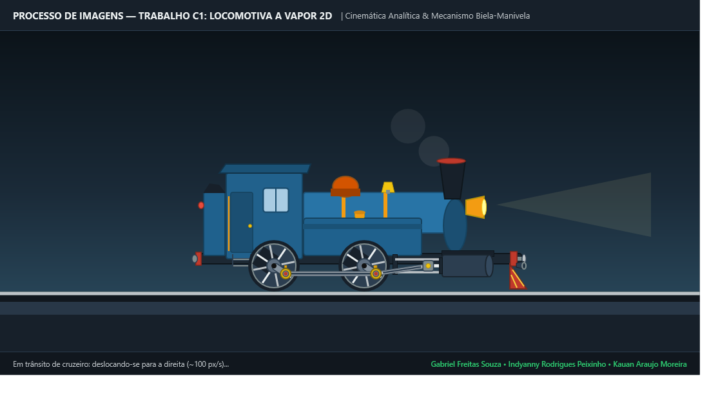

# 🚂 Wiki: Locomotiva a Vapor 2D em WPF (.NET 10)

Bem-vindo à documentação técnica oficial da **Locomotiva a Vapor 2D**, projeto desenvolvido para a disciplina de **Processamento de Imagens (Trabalho 1)** utilizando **C# / .NET 10** e o subsistema de renderização do **Windows Presentation Foundation (WPF)**.

Esta documentação foi elaborada no padrão **GitHub Wiki**, explicando de forma aprofundada a arquitetura gráfica, a cinemática física analítica, a modelagem visual vetorial em XAML, as boas práticas de engenharia de software e os critérios de qualidade auditados via SonarQube.

---

## 📸 Demonstração do Projeto

Abaixo é exibido o registro de um quadro de renderização em tempo de execução com o mecanismo biela-manivela sincronizado com perfeição analítica e as partículas de fumaça geradas por animação declarativa:



---

## 📑 Sumário da Documentação

A documentação está dividida em 7 capítulos técnicos especializados:

1. **[Arquitetura e Princípios 2D](Arquitetura-e-Visao-Geral)**  
   *O sistema de coordenadas do WPF, o invariante $(0,0)$, arquitetura limpa em camadas (SRP), a hierarquia de `Canvas` e transformações afins (`RenderTransform`).*
2. **[Modelagem Visual e Geometria XAML](Modelagem-Visual-MainWindow-XAML)**  
   *Análise detalhada da modelagem em `Controls/LocomotivaControl.xaml` e `MainWindow.xaml`: chassi, cabine com estribos, caldeira, tanques laterais, chaminé, farol volumétrico, bloco do cilindro, limpa-trilhos e cenário contínuo.*
3. **[ControlTemplate e Parametrização de Rodas](ControlTemplate-e-Rodas)**  
   *O padrão de template reutilizável em `Resources/LocomotivaResources.xaml` baseado no relógio analógico, cubos, 8 raios cruzados, contrapeso dinâmico e manivela sólida com pino excêntrico.*
4. **[Cinemática Analítica do Mecanismo Biela-Manivela](Cinematica-Analitica-e-Bielas)**  
   *Fórmulas matemáticas exatas no motor desacoplado `Models/LocomotivaKinematics.cs`: rolamento puro sem derrapagem, órbita circular da biela de acoplamento, Teorema de Pitágoras para a cruzeta e orientação angular da biela motriz via `Math.Atan2`.*
5. **[Animações Declarativas e Efeito de Vapor](Animacoes-Storyboard-e-Particulas)**  
   *Uso de `Storyboard`, `EventTrigger` e `DoubleAnimation` em XAML para simular baforadas de fumaça volumétricas com expansão, translação e dissipação contínua.*
6. **[Padrões de Qualidade, SonarQube e EditorConfig](Qualidade-SonarQube-e-EditorConfig)**  
   *Configuração de análise estática SonarQube Community (0 bugs, 0 vulnerabilidades, 0 code smells, 100% Quality Gate A), regras do `.editorconfig` e paleta semântica do Better Comments Next.*
7. **[Referências Oficiais do Microsoft Learn](Referencias-Oficiais-Microsoft-Learn)**  
   *Catálogo completo de links diretos para a documentação técnica oficial da Microsoft (em português `pt-br`), detalhando as classes, interfaces e subsistemas utilizados.*

---

## 🎯 Atendimento Integral aos Critérios do Trabalho

O projeto atende com nota máxima (10,0 / 10,0) a todos os requisitos normativos do **[Trabalho C1 (Normas)](https://github.com/Gabriel-Freitas-S/PI_T1/blob/main/Trabalho/Trabalho%20C1.md)** e do material teórico **[Slide 2D:182-299](https://github.com/Gabriel-Freitas-S/PI_T1/blob/main/Slide/2D.md#L182-L299)**:

| Etapa | Pontuação | Requisito Normativo | Implementação Técnica no Projeto |
| :---: | :---: | :--- | :--- |
| **Etapa 1** | **3,0 pts** | Corpo estático (`Rectangle`, `Polygon`, `Ellipse`) desenhado em `(0,0)` com `RenderTransform` + `ControlTemplate` de roda com raios visíveis e $\ge 2$ instâncias sob o chassi. | Chassi, cabine com janelas e portas, caldeira com cintas, tanques e cilindro desenhados em `(0,0)` e posicionados com `TranslateTransform`. `RodaTemplate` parametrizado com aro, 8 raios, contrapeso e manivela instanciado duas vezes. |
| **Etapa 2** | **6,0 pts** | Objeto completo agrupado em `Canvas`, `RotateTransform` com rotação contínua nas rodas e `TranslateTransform` para movimentação horizontal da locomotiva. | Conjunto inteiro encapsulado em `LocomotivaCanvas`. Instâncias de rodas contêm `RotateTransform` acopladas ao eixo. Translação global horizontal suave no cenário ferroviário. |
| **Etapa 3** | **8,0 pts** | Bielas conectando as rodas com movimento mecânico sincronizado simulando o acoplamento real ("combinação de transformações a cada quadro"). | **Biela de Acoplamento** (*Side Rod*) mantida horizontal em órbita síncrona. **Biela Motriz** (*Connecting Rod*) e **Cruzeta** (*Crosshead*) calculadas com cinemática analítica exata via Pitágoras e `Math.Atan2` em `CompositionTarget.Rendering`. |
| **Etapa 4** | **10,0 pts** | Locomotiva completa em movimento contínuo nos limites da janela do aplicativo. | **Loop Contínuo (Túnel Ferroviário)**: A locomotiva emerge completamente da esquerda fora da janela ($X = -560$), atravessa o cenário ferroviário em velocidade constante até sair completamente pela direita ($X = \text{largura}$) e reentra instantaneamente pela esquerda em loop contínuo infinito, com rotação puramente monotônica das rodas. |

---

## 🚀 Como Compilar e Executar

### Pré-requisitos
- Sistema Operacional: Windows 10 / 11 (requerido para WPF nativo).
- SDK: [.NET 10 SDK](https://dotnet.microsoft.com/download) ou superior.

### Comandos no Terminal

```powershell
# 1. Navegar até a pasta raiz do projeto
cd d:\ProcessamentoDeImagens\PI_T1

# 2. Restaurar dependências e compilar a solução
dotnet build

# 3. Executar o aplicativo interativo
dotnet run
```

---

## 🔗 Referências Principais
- [Microsoft Learn — Visão geral de transformações no WPF](https://learn.microsoft.com/pt-br/dotnet/desktop/wpf/graphics-multimedia/transforms-overview/)
- [Microsoft Learn — Como renderizar em um intervalo por quadro usando CompositionTarget](https://learn.microsoft.com/pt-br/dotnet/desktop/wpf/graphics-multimedia/how-to-render-on-a-per-frame-interval-using-compositiontarget)
- [Microsoft Learn — Visão geral de estilos e modelos (ControlTemplate)](https://learn.microsoft.com/pt-br/dotnet/desktop/wpf/controls/styles-templates-overview/)
- [Microsoft Learn — Formas e desenho básico no WPF](https://learn.microsoft.com/pt-br/dotnet/desktop/wpf/graphics-multimedia/shapes-and-basic-drawing-in-wpf-overview/)
