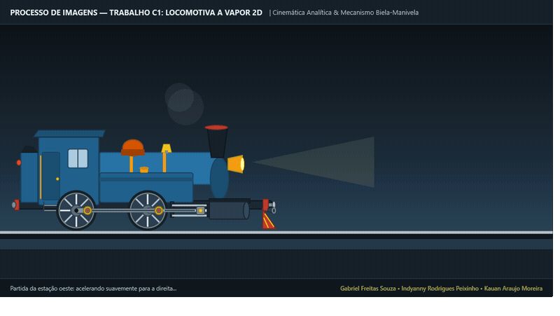

# Documentação Técnica: Locomotiva a Vapor 2D em WPF (.NET 10)

[](https://learn.microsoft.com/pt-br/dotnet/desktop/wpf/)
[](https://learn.microsoft.com/pt-br/dotnet/desktop/wpf/)
[](https://sonarcloud.io/summary/new_code?id=Gabriel-Freitas-S_PI_T1)
[](https://sonarcloud.io/summary/new_code?id=Gabriel-Freitas-S_PI_T1)
[](Arquitetura-e-Visao-Geral)
[-brightgreen?style=flat-square)](Trabalho/Trabalho%20C1.md)

Bem-vindo à documentação técnica oficial da **Locomotiva a Vapor 2D**, projeto de computação gráfica desenvolvido para a disciplina de **Processamento de Imagens (Trabalho C1)** utilizando **C# / .NET 10** e o subsistema vetorial acelerado por hardware do **Windows Presentation Foundation (WPF)**.

Esta base de conhecimento foi estruturada no padrão de documentação de engenharia de software: aborda os fundamentos teóricos de transformações afins 2D, a decomposição geométrica de primitivas em coordenadas canônicas $(0,0)$, a cinemática física analítica com precisão contínua em tempo real e a arquitetura **MVVM (Model-View-ViewModel)** otimizada para zero alocações na heap a 60/144 FPS.

---

## Demonstração do Sistema em Execução

O registro animado abaixo ilustra o comportamento cinemático contínuo da locomotiva em tempo real: movimento pendular horizontal de vai-e-volta (Ping-Pong) nos limites visíveis da janela, aceleração e frenagem suaves, rotação analítica das rodas sem patinagem, mecanismo biela-manivela perfeitamente acoplado e sistema de vapor volumétrico:



---

## Estrutura da Documentação

A documentação está organizada em 7 capítulos técnicos sequenciais e complementares:

1. **[Arquitetura, Padrão MVVM e Princípios Gráficos](Arquitetura-e-Visao-Geral)**  
   *Análise do sistema de coordenadas do WPF, princípio invariante da origem $(0,0)$, aceleração gráfica por hardware via `RenderTransform` versus `LayoutTransform` e arquitetura MVVM desacoplada com otimização Zero-Alloc no Garbage Collector.*
2. **[Modelagem Visual e Geometria XAML](Modelagem-Visual-MainWindow-XAML)**  
   *Decomposição estrutural da locomotiva-tanque 0-4-0T em primitivas analíticas (`Rectangle`, `Ellipse`, `Polygon`, `Line`), análise funcional de cada seção da máquina e ordenamento em profundidade ($Z\text{-Index}$).*
3. **[ControlTemplate e Parametrização Modular de Rodas](ControlTemplate-e-Rodas)**  
   *Padrão de matriz estrutural reutilizável (`ControlTemplate`), geometria analítica de 8 raios convergentes e manivela excêntrica com raio $r = 22\text{ px}$, espelhando o modelo do relógio analógico dos slides teóricos.*
4. **[Cinemática Analítica do Mecanismo Biela-Manivela](Cinematica-Analitica-e-Bielas)**  
   *Motor de física pura `LocomotivaKinematics.cs`: trajetória Ping-Pong nos limites da janela com perfil de velocidade trapezoidal suavizado, Teorema de Pitágoras no triângulo da biela motriz, cálculo angular horário via `Math.Atan2` e inversão simétrica por `ScaleTransform`.*
5. **[Animações Declarativas e Efeito de Vapor em XAML](Animacoes-Storyboard-e-Particulas)**  
   *Subsistema de linhas do tempo vetoriais (`Storyboard` e `DoubleAnimation`), modelagem física de empuxo térmico ascendente, expansão volumétrica e atenuação de opacidade com defasagem temporal (*staggering*).*
6. **[Padrões de Qualidade, SonarQube e EditorConfig](Qualidade-SonarQube-e-EditorConfig)**  
   *Resultados da auditoria estática com SonarQube Community Edition (0 bugs, 0 vulnerabilidades, 0 code smells, Rating A) e convenções de codificação e formatação do `.editorconfig`.*
7. **[Referências Oficiais do Microsoft Learn](Referencias-Oficiais-Microsoft-Learn)**  
   *Compêndio de especificações e documentações oficiais da Microsoft para todas as APIs de computação gráfica 2D, transformações matriciais, componentes XAML e recursos de runtime utilizados.*

---

## Conformidade Normativa com o Trabalho C1

O projeto cumpre integralmente os 4 estágios avaliativos estabelecidos nas especificações formais do **[Trabalho C1 (Normas)](https://github.com/Gabriel-Freitas-S/PI_T1/blob/main/Trabalho/Trabalho%20C1.md)** e nas aulas teóricas de computação gráfica **[Slide 2D:182-299](https://github.com/Gabriel-Freitas-S/PI_T1/blob/main/Slide/2D.md#L182-L299)**:

| Estágio Avaliativo | Pontuação | Requisito Formal | Implementação Técnica no Projeto |
| :---: | :---: | :--- | :--- |
| **Estágio 1** | **3,0 pts** | Modelagem do corpo estático da locomotiva (`Rectangle`, `Polygon`, `Ellipse`) na origem $(0,0)$ com `RenderTransform` e criação de `ControlTemplate` de roda com raios internos visíveis e $\ge 2$ instâncias sob o chassi. | Chassi rígido, cabine de comando com estribos, caldeira com cintas de bronze, tanques laterais, domo e cilindro desenhados em $(0,0)$ com `TranslateTransform`. `RodaTemplate` modular com 8 raios em cruz e diagonais, contrapeso e manivela instanciado duas vezes sob o chassi. |
| **Estágio 2** | **6,0 pts** | Agrupamento completo dos elementos em `Canvas`, aplicação de `RotateTransform` com animação contínua nas rodas e `TranslateTransform` no `Canvas` para translação horizontal. | Toda a composição encapsulada no `LocomotivaCanvas`. Instâncias das rodas acopladas a `RotateTransform` centradas em $(40,40)$. Translação global do contêiner sobre trilhos de aço com tangência matemática calculada em $Y = 405\text{ px}$. |
| **Estágio 3** | **8,0 pts** | Modelagem das bielas conectando as rodas com movimento mecânico sincronizado simulando a operação real ("combinação de transformações a cada quadro"). | **Biela de Acoplamento** (*Side Rod*) mantida em paralelismo horizontal contínuo em órbita circular síncrona. **Biela Motriz** (*Connecting Rod*) e **Cruzeta** (*Crosshead*) calculadas analiticamente quadro a quadro via Pitágoras e `Math.Atan2` em `CompositionTarget.Rendering`. |
| **Estágio 4** | **10,0 pts** | Movimentação horizontal completa da composição na janela principal da aplicação, indo e voltando até alcançar os limites da janela. | **Movimento Vai-e-Volta (Ping-Pong)**: Percurso horizontal contínuo entre $X_{\min} = 20\text{ px}$ e $X_{\max} = \text{largura} - 580\text{ px}$, mantendo o trem 100% visível na tela. Aplica aceleração suave, cruzeiro constante, frenagem realista até repouso, pausa de 1s para manobra e inversão visual com `ScaleTransform` (`ScaleX = -1 / 1`). |

---

## Instruções de Compilação e Execução

### Requisitos de Ambiente

- **Sistema Operacional**: Windows 10 / Windows 11 (requerido para compilação e execução do subsistema nativo do WPF).
- **Ambiente de Runtime**: [.NET 10 SDK](https://dotnet.microsoft.com/download) ou superior.
- **Ferramenta Opcional**: FFmpeg (necessário exclusivamente caso se deseje reexecutar o script de gravação `generate_gif.ps1`).

### Execução via Terminal PowerShell / Prompt de Comando

```powershell
# 1. Navegar até a raiz da solução
cd d:\ProcessamentoDeImagens\PI_T1

# 2. Restaurar dependências e compilar em configuração de Release
dotnet build PI_T1.sln -c Release

# 3. Inicializar a aplicação interativa
dotnet run
```

### Comandos de Automação Headless

```powershell
# Geração de captura estática determinística (ex: no instante t = 3.5 segundos)
dotnet run -- --screenshot 3.5 frame_check.png

# Gravação de quadros brutos para montagem de animação (15 segundos a 20 FPS)
dotnet run -- --record-frames 15.0 20 frames_dir
```

---

## Referências Oficiais da Microsoft

- [Microsoft Learn — Visão Geral de Transformações Afins no WPF](https://learn.microsoft.com/pt-br/dotnet/desktop/wpf/graphics-multimedia/transforms-overview/)
- [Microsoft Learn — Evento CompositionTarget.Rendering](https://learn.microsoft.com/pt-br/dotnet/api/system.windows.media.compositiontarget.rendering)
- [Microsoft Learn — Visão Geral de Modelos de Controle (ControlTemplate)](https://learn.microsoft.com/pt-br/dotnet/desktop/wpf/controls/controltemplates-overview/)
- [Microsoft Learn — Formas e Desenho Básico no WPF](https://learn.microsoft.com/pt-br/dotnet/desktop/wpf/graphics-multimedia/shapes-and-basic-drawing-in-wpf-overview/)
- [Microsoft Learn — Otimizando o Desempenho da Associação de Dados](https://learn.microsoft.com/pt-br/dotnet/desktop/wpf/advanced/optimizing-performance-data-binding)
